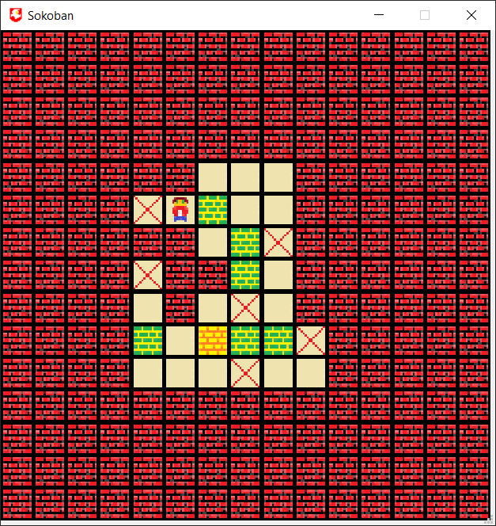

## Into

<table>
    <tr>
        <td></td>
        <td>Game icon</td>
    </tr>
    <tr>
        <td></td>
        <td>Empty cell</td>
    </tr>
    <tr>
        <td></td>
        <td>Cell with a finish for a box</td>
    </tr>
    <tr>
        <td></td>
        <td>Player cell</td>
    </tr>
    <tr>
        <td></td>
        <td>Cell with a player at the finish</td>
    </tr>
    <tr>
        <td></td>
        <td>Cell with box</td>
    </tr>
    <tr>
        <td></td>
        <td>Cell with a box at the finish</td>
    </tr>
    <tr>
        <td></td>
        <td>Cell with wall</td>
    </tr>
    <tr>
        <td></td>
        <td>Cell without functionality</td>
    </tr>
</table>

## Task

> **Цель работы**:
> приобрести практические навыки проектирования и разработки приложений
> с графическим пользовательским интерфейсом в ОС Windows средствами Qt.
>
> Вариант 5
> 
> Игра «Сокобан».
> Один уровень игры.
> Общая идея: имеется комната-лабиринт (15Х15 ячеек),
> в которой необходимо расставить ящики (5 штук) на указанные позиции.
> Главный герой может лишь толкать ящики вперед.
> Таким образом, возможны конфигурации, из которых не возможно построить желаемое решение
> (например, если ящик был задвинут в тупик).
